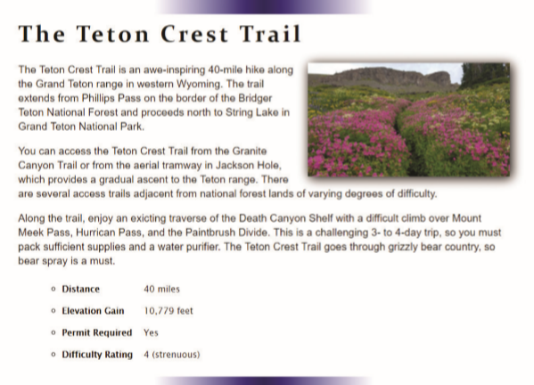

# Summary

You have been given a file containing several coding errors that need to be fixed for the page to pass validation. Locate and fix the errors in the web page. A preview of the fixed page is shown in _Figure 1–49_.

_Figure 1-49_

Do the following:
