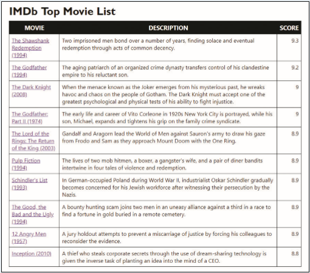

# Summary

In this Coding Challenge you will use JavaScript to write the contents of a table listing the top ranked movies on the IMDb website. The names of the movies, descriptions, scores, and links to pages describing the movies have been stored in arrays. You will use a for loop to write the individual rows of the table. *Figure 10–35* shows a preview of the completed page. 

*Figure 10-35*

Do the following: