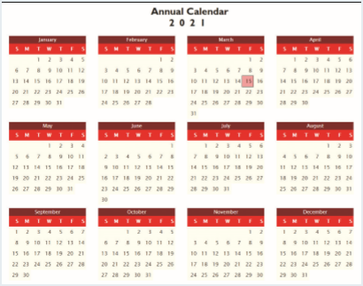

# Summary

**Figure 10–37** shows a page that contains monthly calendars for every month of the year. You’ve been given the files for this page but there are several errors that prevent the code from running correctly. You will analyze the code and correct the mistakes.

*Figure 10-37*

Do the following: