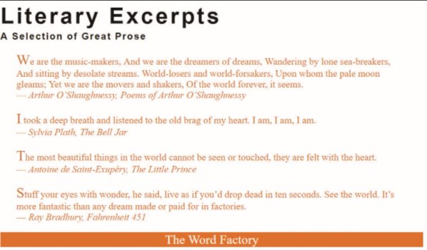

# Summary
Use CSS to format the appearance of a web page containing several literary quotes marked as `blockquote` elements. *Figure 2–54* shows a preview of the formatted page. 

*Figure 2-54*

Do the following: