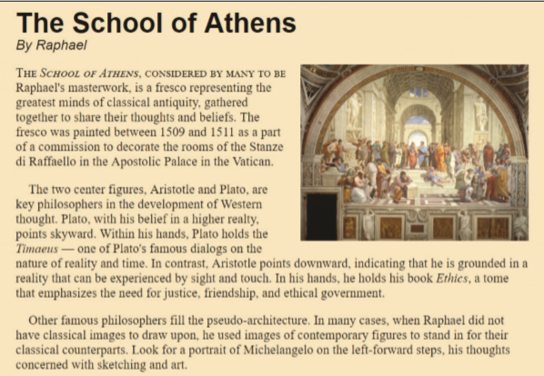

# Summary 
An article describing the fresco *School of Athens* by the Renaissance painter Raphael is shown in *Figure 2–56*. Much of the HTML and CSS code has been created for you. Complete the web page design by adding the missing CSS styles.

*Figure 2-56*

Do the following:
