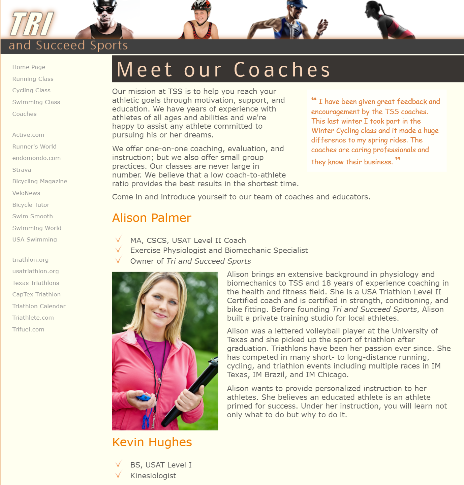

# Summary

Alison has created another page for the Tri and Succeed Sports website providing biographies of the coaches at the club. She has already written the page content, acquired image files, and created a style sheet for the page layout. She wants you to finish the design of the page by developing a style sheet for the page’s color scheme and typography. A preview of the page you’ll design is shown in _Figure 2–58_.

_Figure 2-58_

> This is image does not represent the entire webpage.
