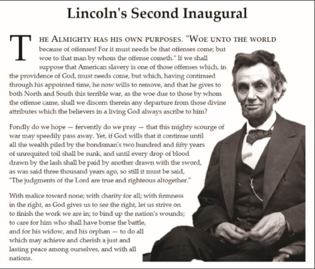

# Summary

_Figure 3–79_ shows an example page containing two applications of floating objects. In the first line of Lincoln’s second inaugural speech a drop capital is created by floating the first letter of the first paragraph next to the surrounding text. The text of the speech is wrapped around the image of Lincoln using an irregular line wrap. This effect is created by cutting the Lincoln image into separate strips which are floated and stacked on top of each other. In this Coding Challenge you will explore how to create both effects.

_Figure 3-79_

Do the following:
