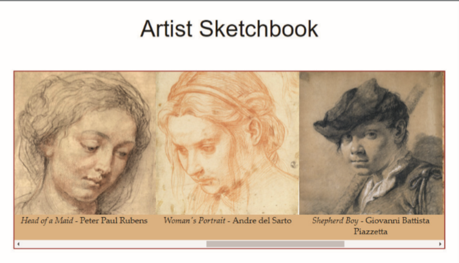

# Summary
You can use the CSS positioning and overflow styles to create a scrolling slideshow. *Figure 3–81* shows an example of a slideshow consisting of nine sketches by Renaissance masters. You’ve been given the HTML code for this document and you’ve been asked to write the style rules to generate the slideshow.

*Figure 3-81*

Do the following: