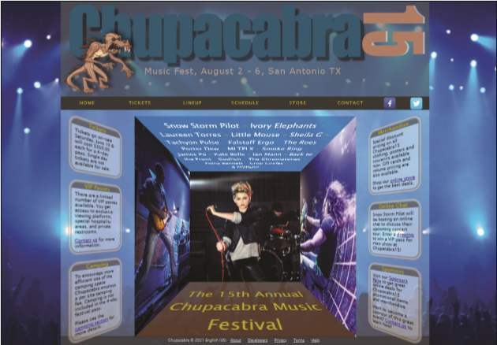

# Summary

**Chupacabra Music Festival** - Debra Kelly is the director of the website for the Chupacabra Music Festival, which takes place every summer in San Antonio, Texas. Work is already underway on the website design for the 15th annual festival and Debra has approached you to work on the design of the home page. Debra envisions a page that uses semi-transparent colors and 3D transformations to make an attractive and eye-catching page. A preview of her completed design proposal is shown in *Figure 4–71*.

*Figure 4-71*

Debra has provided you with the HTML code and the layout and reset style sheets. Your job will be to finish her work by inserting the graphic design styles. 