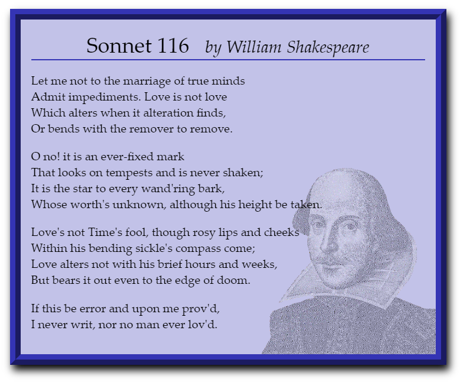

# Summary

_Figure 4–64_ shows a web page containing text from a Shakespearean sonnet. In this Coding Challenge you will augment the text of the poem with background colors and images and add a graphic border.

_Figure 4-64_

Do the following:
