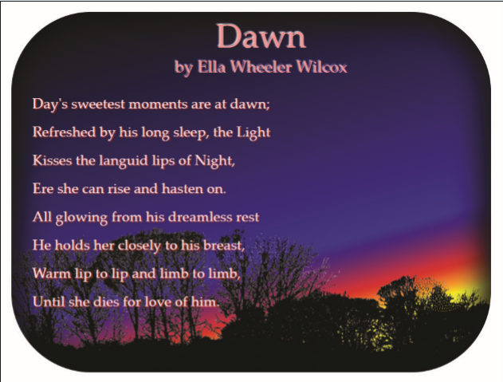

# Summary

*Figure 4–65* shows a web page containing text of a poem by Ella Wheeler Wilcox entitled “Dawn.” To augment the poem, a background image containing a linear gradient has been added to the web page. In addition, text shadows have been added to bring the text of the poem out of the page.

*Figure 4-65*

Do the following:
