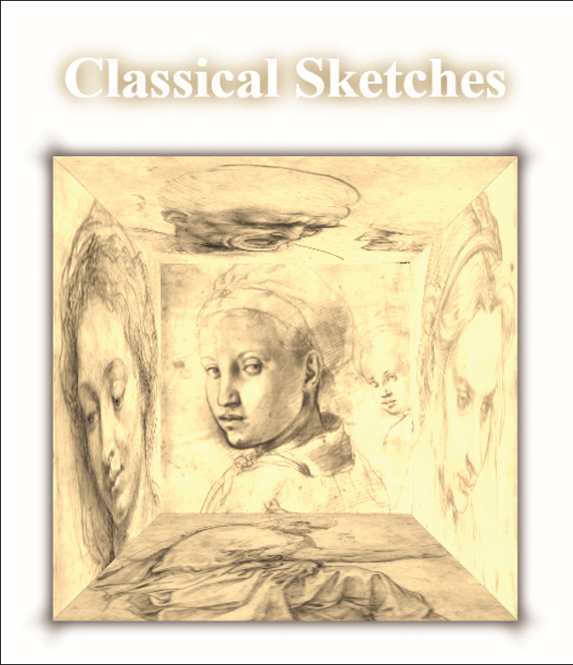

# Summary

*Figure 4–66* shows a web page in which five faces of the cube are displayed in a 3D view. You can create this effect using the CSS 3D transformation styles. The page also contains CSS styles for box shadows and text shadows that you will have to add.

*Figure-66*

Do the following: