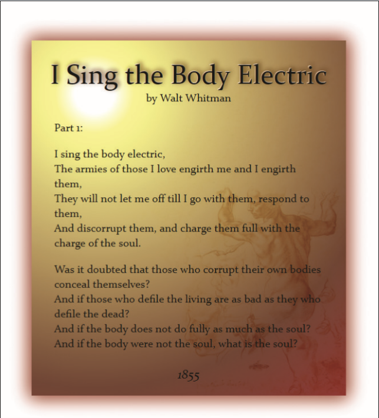

# Summary

*Figure 4–67* shows a completed web page that uses CSS design elements to enhance the appearance of a poem by Walt Whitman. You’ve been given a copy of the files for this web page, but there are several syntax errors in the CSS stylesheet. Use your knowledge of CSS to fix the stylesheet code and complete the page

*Figure 4-67*

Do the following: