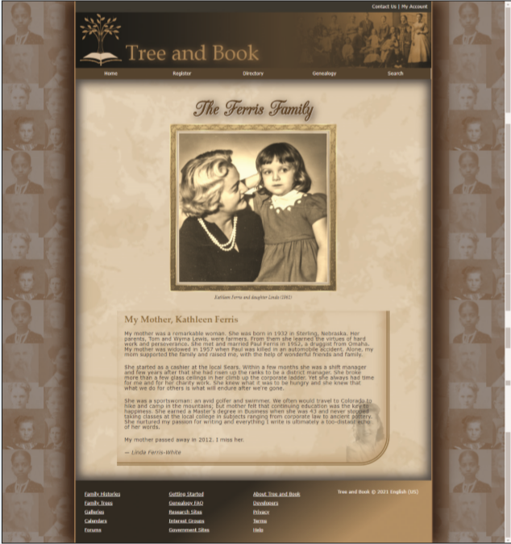

# Summary

Kevin wants you to work on another family page for the Tree and Book website. The page was created for the Ferris family with content provided by Linda Ferris-White. Kevin is examining a new color scheme and design style for the page. A preview of the design you’ll create is shown in *Figure 4–68*.

*Figure 4-68*

All of the HTML content and the typographical and layout styles have already been created for you. Your task will be to complete the work by writing the visual style sheet to incorporate Kevin’s suggestions. 