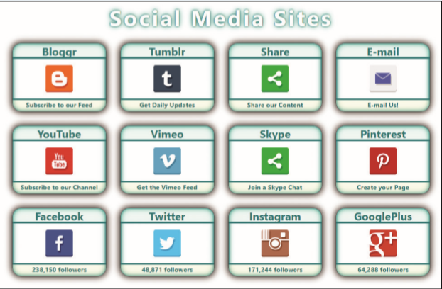

# Summary

*Figure 5–58* shows the layout of a page that displays cards containing social media icons. Create this page using CSS flex styles so that the icons are always laid out in rows and columns for any screen width. 

*Figure 5-58*

Do the following: