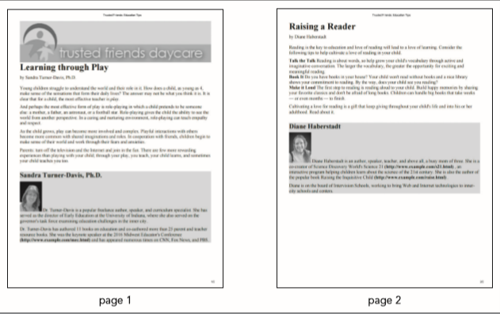

# Tablets and Desktop Devices

Go to the "Tablets and Desktop Devices" section. Create a media query for screen devices with a `width` of at least **481** pixels. Under the wider screens, the contents of the horizontal navigation list at the top of the page should be displayed in several columns. In order to have the list items wrap to a new column, add a style rule to the media query that sets the height of the `ul` element within the horizontal navigation list to **160** pixels.

Verify that as you change the screen width the layout of the page automatically changes to match the layout designs shown in *Figure 5–61*.  Next, you’ll create the print styles for the Parenting Tips page. *Figure 5–62* shows a preview of the output on a black and white printer.

*Figure 5-62*

# Hidden Objects

Go to the *tf_print2.css* file and go to the "Hidden Objects" section and hide the display of the following page elements: all navigation lists, the `h1` heading in the `body header`, the `left` `section` element, and the `body footer`. 