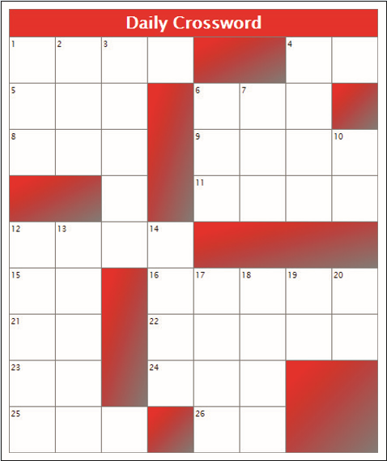

# Summary

You’ve been tasked to create a crossword puzzle web page. The first step is to create the layout of the crossword puzzle table, including the numbering of the clues and the shading of the blank spaces. _Figure 6–49_ shows a preview of the completed table.

_Figure 6-49_

Do the following:
