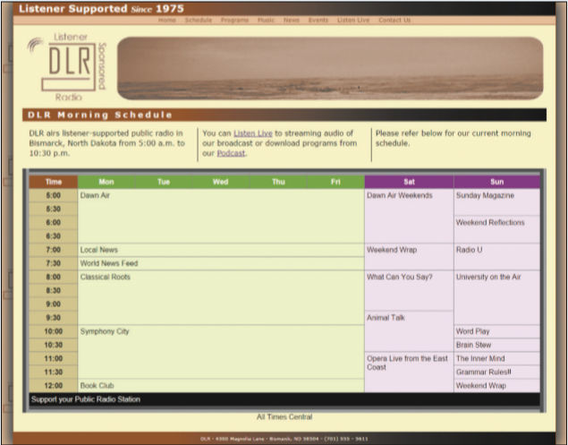

# Summary

Kyle has reviewed your work on the DLR nightly schedule page. He wants you to make a few changes to the layout and apply those changes to a new page that describes the DLR morning schedule. Kyle already has entered much of the web page content and style. He wants you to complete his work by creating and designing the web table listing the times and programs for the morning schedule. *Figure 6–52* shows a preview of the morning schedule page.

*Figure 6–52*

