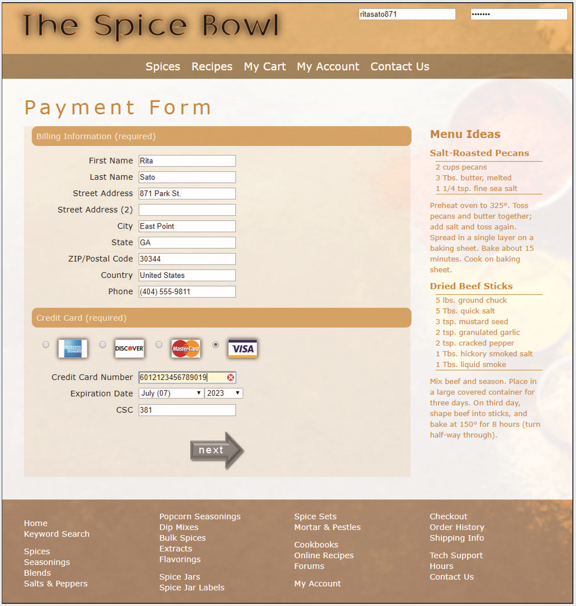

# Summary

*The Spice Bowl* - Rita Sato is the manager of the web development team for The Spice Bowl, an online grocery store specializing in gourmet spices. She has asked you to create web forms for the site. You will start your work by developing a payment form used to collect billing and credit data from the store’s customers. The form should include validation tests for credit card numbers to ensure that the card numbers match the correct credit card number patterns. The page should also include a form in which users can log into their Spice Bowl account. *Figure 7–67* shows a preview of the page you will create for Rita.

*Figure 7-67*

