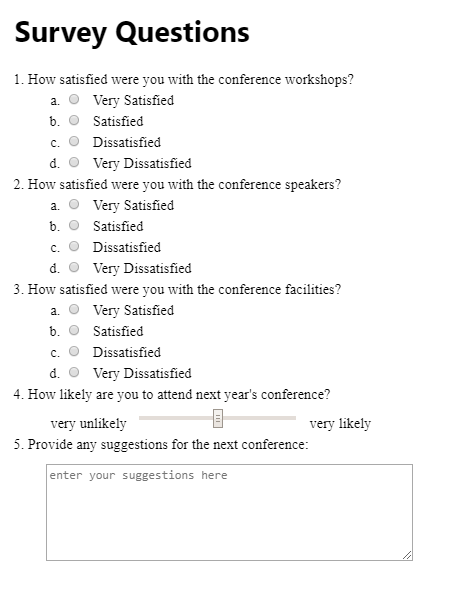

# Summary
You’ve been asked to create a survey web form for use in a seminar conference website. Some of the questions from the form are shown in *Figure 7–60*. Use your knowledge of HTML form elements to create the form elements and labels. 

*Figure 7-60*

Do the following:
