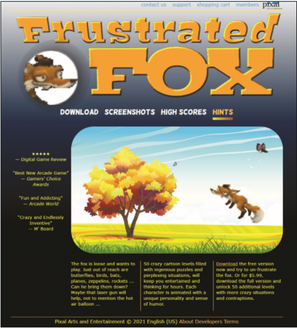

# Summary

*Pixal Arts and Entertainment* - Heather Neidell manages the website for Pixal Arts and Entertainment, a company specializing in games and entertainment apps. She has asked you to work on the initial page for the company’s new game, Frustrated Fox. To make the page come alive, she wants you to enhance the page with animation using sprites from several characters in the game. A preview of the page you will create is shown in *Figure 8–65*.

*Figure 8-65*

