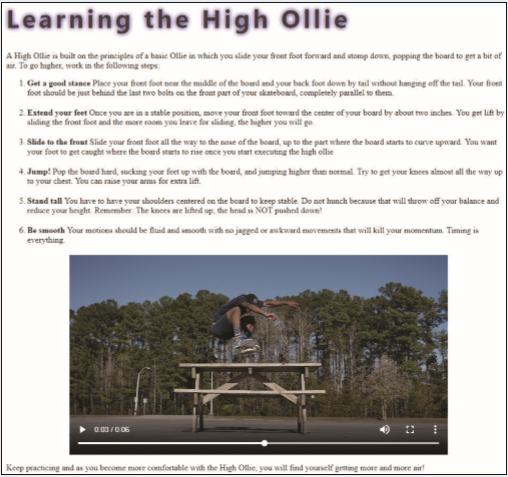

# Summary

You are working on a skateboard website that provides instruction in various skateboarding techniques. In this coding challenge you will complete a web page detailing how to perform a trick known as a High Ollie in which the skateboarder jumps over high obstacles. You will augment the page with a video of the trick being performed. See *Figure 8–59*. 

*Figure 8-59*

Do the following: