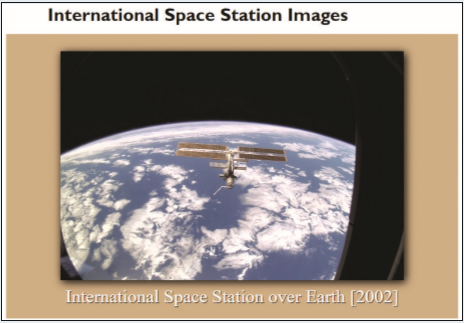

# Summary

You can use JavaScript to display a random gallery of images. A page of a random gallery of images of the International Space Station has been created for you, but there are errors in the code. Locate and fix the errors to display the gallery. One of the images with its caption is shown in *Figure 9–43*.

*Figure 9-43*

Do the following: 
