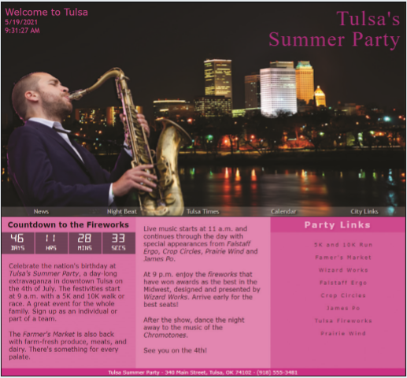

# Summary

 Hector wants you to create a countdown clock page for the Tulsa Summer Party held on July 4th of every year. He wants the page to show the current date and time and to include a timer that counts down to the start of the fireworks at 9 p.m. on the 4th. Hector has already completed the page content and needs you to write the JavaScript code. A preview of the completed page for a sample date and time is shown in *Figure 9–44*.

*Figure 9-44*
